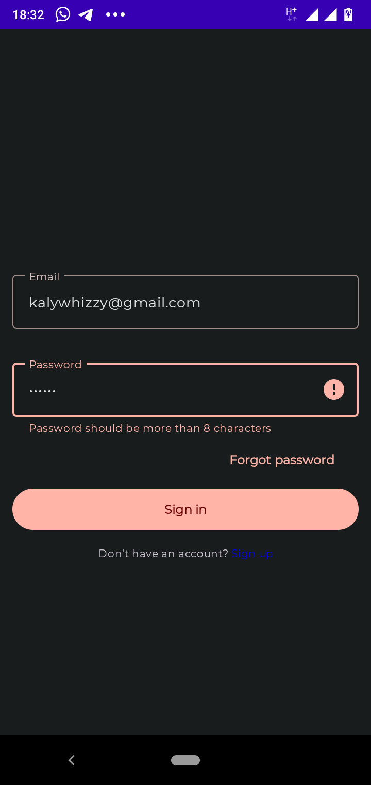
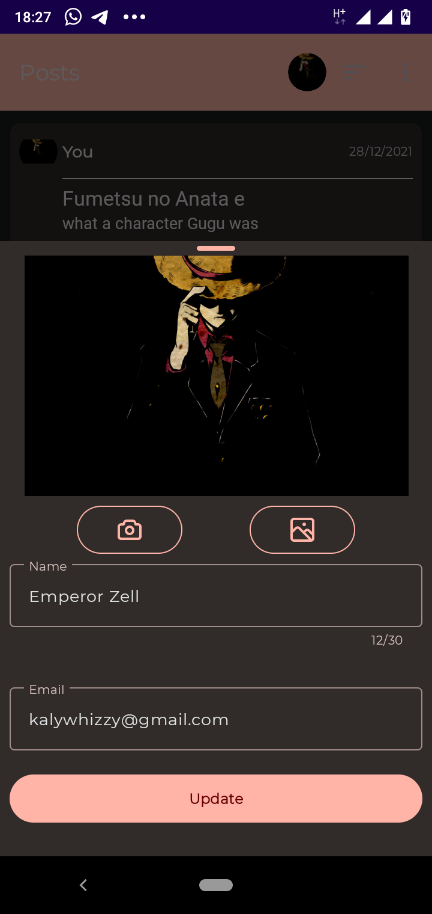

# UpPics
A simple app that authenticates a user and allows them to post images which can then be upvoted or downvoted by other users.
Images can either be existing images on their device or a picture taken using the camera which is then sent to the app.
## Screenshots

## Frameworks used
- Firebase Auth
- Firebase Storage
- Firebase Realtime Database
- Google Material Design API
- Androidx Navigation API
